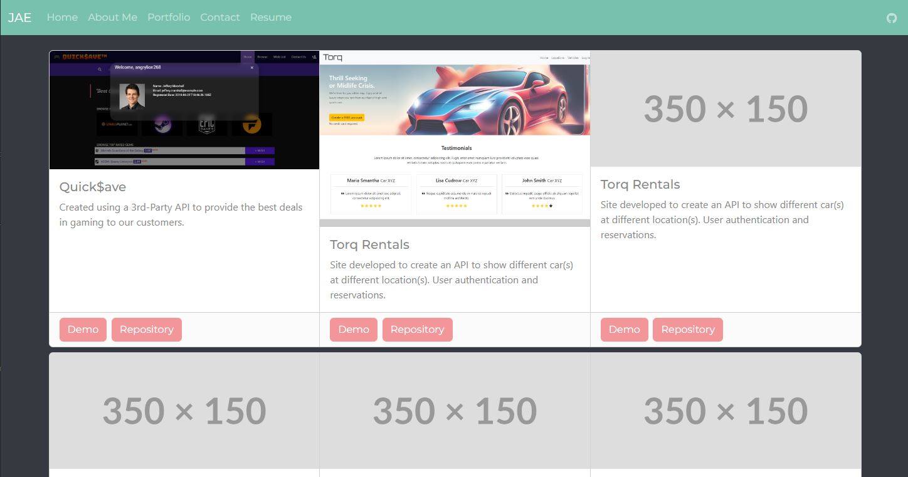

# React-Based Porfolio
Portfolio concept built using React & Vite.

# Table of Contents
* [Installation](#installation)
* [Usage](#usage)
* [Demo](#demo)
* [Screenshot](#screenshot)

# Installation
```bash
git clone git@github.com:CLTJared/portfolio-react.git
```

## Usage
After cloning locally, run the following commands in your terminal.
1. cd path/to/project-folder
2. npm install
3. npm run start
4. Open a browser to `http://localhost:3000/` to view

## Demo
Visit my [Netlify Deployment](https://main--cltjared-react-portfolio.netlify.app/) to view a demo site.

## Screenshot


# Project Information
Below you can find information on any technologies used, licensing, or other project information you may be interested in.

## Technologies Used
| Package | Link | Description |
| :--- | :--- | :--- |
| Vite      | https://www.npmjs.com/package/vite | Local testing, server & front-end |
| React      | https://react.dev/ | Create components to re-use and develop front-end |
| Bootstrap      | https://getbootstrap.com/ | CSS Framework to standarize development |
| Bootstrap Minty | https://bootswatch.com/minty/ | Theme for bootstrap |


## License
This project is licensed under the MIT License. See [LICENSE](./LICENSE) for more information.